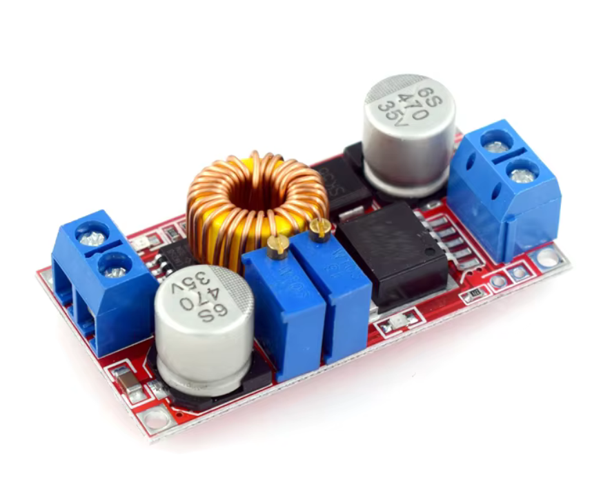
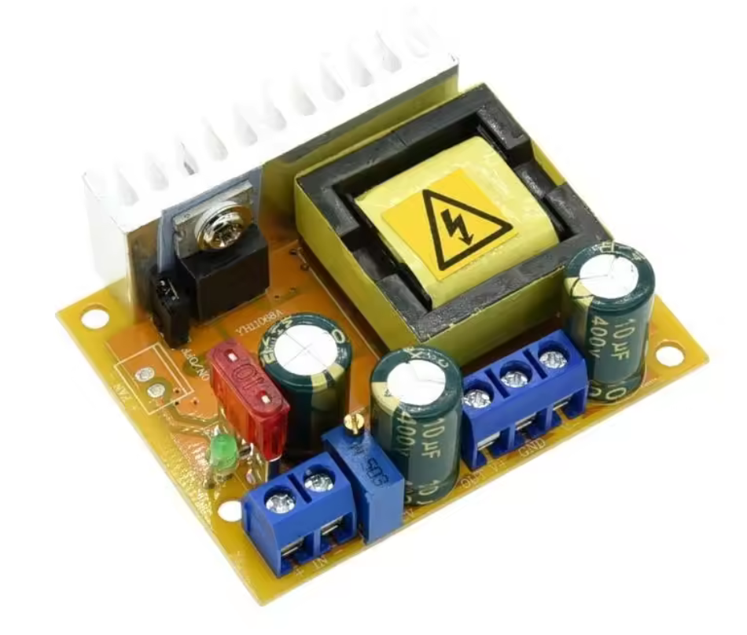
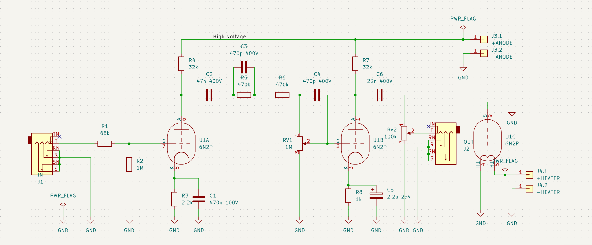
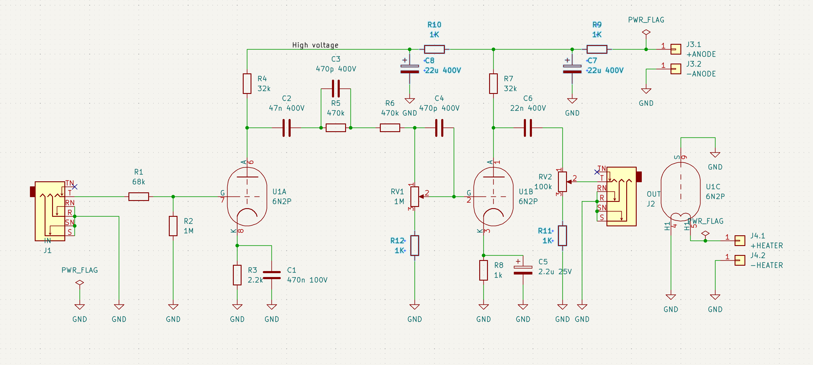
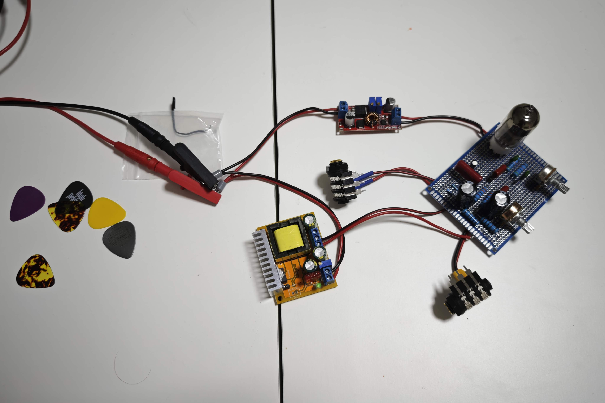
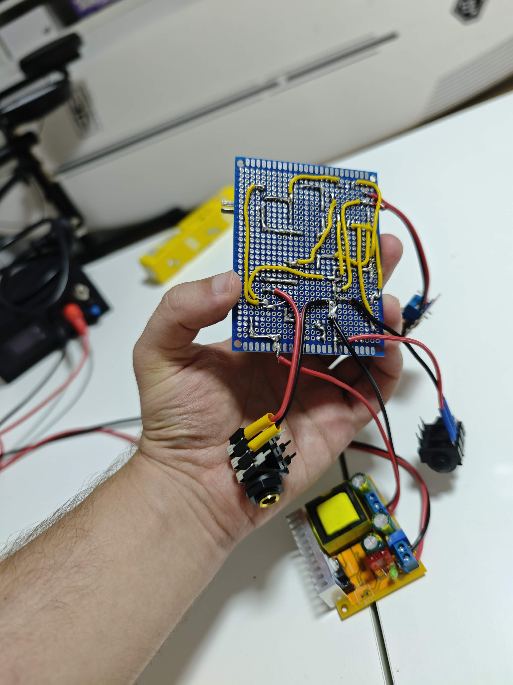

# Tomato / Adjika preamp

This preamp uses USSR vacuum tube 6N2P (similar but not the same as 12AX7).

The modifications I have made are:

1. using two switching mode DC-DC converter modules (8..30V -> 6.3V; 5..30V -> 120V) for power instead of power transformers; modules are available on AliExpress under _"8-32V to 45-390V DC-DC Boost Converter Step Up Power Supply Module High Voltage ZVS Capacitor Charging Board"_ search terms and _"XL4015 Constant Voltage Current Step Down Buck Converter Module DC-DC 5V-32V to 0.8V-30V 5A adjust Lithium Battery Charger Board"_
2. because of the above, I ended up having strong motorboating effect, to counter that it took 2 large electrolytic capacitors (22uF 400V) and two high-power resistors (1K 2W) for an RC filter on each of the anode circuit
3. adding a 1K 0.25W resistor between gain potentiometer and ground plane to prevent gain cutoff at the end position

Power supply modules:

Original schematic:

Modified schematic:

Finished prototype:

